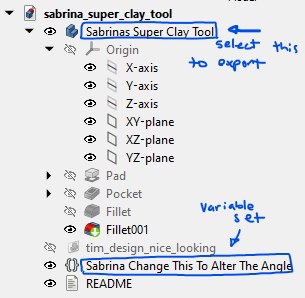

Hi Sabrina,

Download [FreeCAD](https://www.freecad.org/downloads.php) to edit the model.

You can modify the position of the inner point by changing the variable set named `Sabrina Change This To Alter The Angle`.

The variable set has two variables - Pos_X and Pos_Y, each measured from the origin. Try changing these a small amount 
(a few mm's) to see what happens. Once you're happy with how it looks, select the `Sabrinas Super Clay Tool` from the tree
view and press `ctrl-e` to export the model in your prefered format.

Heres an annotated screenshot of FreeCAD to help:

